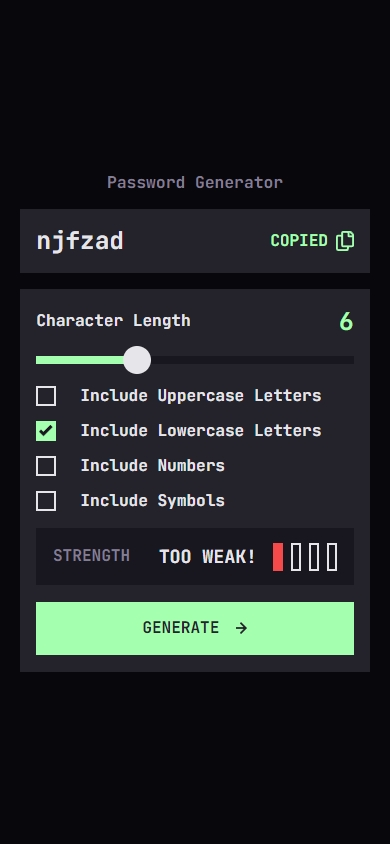
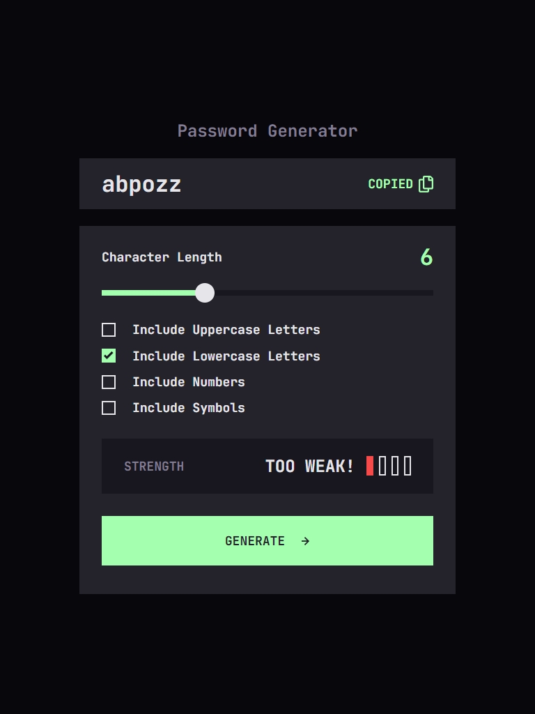
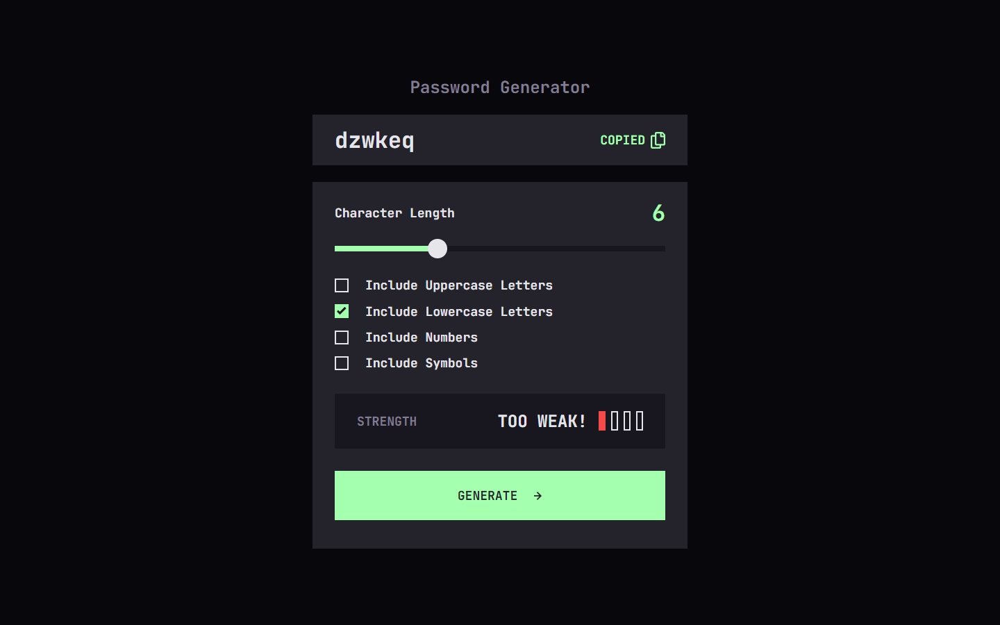

# Frontend Mentor - Password generator app solution

This is a solution to the [Password generator app challenge on Frontend Mentor](https://www.frontendmentor.io/challenges/password-generator-app-Mr8CLycqjh). Frontend Mentor challenges help you improve your coding skills by building realistic projects.

## Table of contents

- [Overview](#overview)
  - [The challenge](#the-challenge)
  - [Screenshot](#screenshot)
  - [Links](#links)
- [My process](#my-process)
  - [Built with](#built-with)
  - [What I learned](#what-i-learned)
  - [Continued development](#continued-development)
  - [Useful resources](#useful-resources)

## Overview

### The challenge

Users should be able to:

- Generate a password based on the selected inclusion options
- Copy the generated password to the computer's clipboard
- See a strength rating for their generated password
- View the optimal layout for the interface depending on their device's screen size
- See hover and focus states for all interactive elements on the page

### Screenshot





### Links

- Solution URL: [https://github.com/skhbabez/password-generator-app](https://github.com/skhbabez/password-generator-app)
- Live Site URL: [https://skhbabez.github.io/password-generator-app/](https://skhbabez.github.io/password-generator-app/)

## My process

### Built with

- Semantic HTML5 markup
- CSS custom properties
- Flexbox
- CSS Grid
- Mobile-first workflow

### What I learned

Styling Sliders was surprisingly challenging due to all the diffrent browser specific selectors. It took me a while to get it working on edge, firefox and chrome. Especially coloring only the left side of the slider required a javascript solution in the end. Luckily, stackoverflow exists.

```js
function updateSliderProgress(sliderValue) {
  const value = ((sliderValue - slider.min) / (slider.max - slider.min)) * 100;
  slider.style.background =
    "linear-gradient(to right, #a4ffaf 0%, #a4ffaf " +
    value +
    "%, #18171f " +
    value +
    "%, #18171f 100%)";
}
```

Styling the checkboxes was also surprisingly difficult, as there aren´t that many ways to style them directly. I learned to use appearance property to hide and restyle them entirely.

```css
.condition-checkbox {
  display: flex;
  align-items: center;
  gap: var(--spacing-300);
}

.condition-checkbox input {
  -webkit-appearance: none;
  appearance: none;
  background-color: transparent;
  margin: 0;
  width: 1.25rem;
  height: 1.25rem;
  border: solid 0.125rem var(--grey-200);
  cursor: pointer;
}

.condition-checkbox input:checked {
  background-color: var(--green-200);
  border: none;
  background-image: url("assets/images/icon-check.svg");
  background-repeat: no-repeat;
  background-position: 50% 50%;
}
```

### Continued development

I should continue working on my workflow. I applied a mobile first approach but especially the spacings required a lot of backtracking. I will try to define global responsive spacings and fonts earlier so i do not have to set them retroactively.

### Useful resources

- [styling-cross-browser-compatible-range-inputs-css](https://css-tricks.com/styling-cross-browser-compatible-range-inputs-css/) - This helped me to style the range input across browsers.
- [pure-css-custom-checkbox-style](https://moderncss.dev/pure-css-custom-checkbox-style/) - This showed me a modern approach to create custom styled checkboxes.
- [CSS filter generator to convert from black to target hex color](https://codepen.io/sosuke/pen/Pjoqqp) - Amazing tool to create filters to color an svg in any color you want.
- [Stackoverflow slider discussion](https://stackoverflow.com/questions/18389224/how-to-style-html5-range-input-to-have-different-color-before-and-after-slider) - Some really good ideas how to style the lower part of a slider based on its value.
- [Utopia](https://utopia.fyi/) - Great tool i used a lot to create my clamp functions for responsive spacings and font sizes
- [Password entropy](https://nordvpn.com/de/blog/what-is-password-entropy/) - How to calculate password entropy
